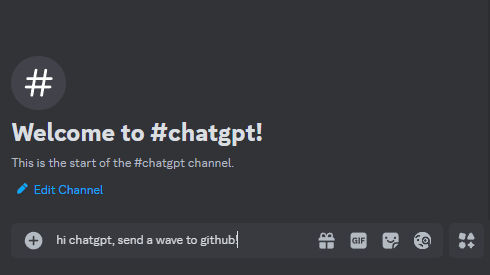

# 🤖 `discord-gpt`

A simple script to use GPT models in a Discord channel (without memories).

## 🧱 Installation

1. Copy the `.example.env` file to `.env`, and replace the values with your own.
2. Install the dependencies with `npm install`.
3. Start the script with `npm start`.

Check the table below for information on every `.env` variable.

| Name                              | Description                                                                                                                                                                                                                                                         | Example                                                   |
|-----------------------------------|---------------------------------------------------------------------------------------------------------------------------------------------------------------------------------------------------------------------------------------------------------------------|-----------------------------------------------------------|
| DISCORD_TOKEN                     | Your Discord bot's token.                                                                                                                                                                                                                                           | abcdef...                                                 |
| DISCORD_CHANNEL_ID                | The channel ID where the bot will work.                                                                                                                                                                                                                             | 123456789                                                 |
| OPENAI_API_KEY                    | Your OpenAI API key.                                                                                                                                                                                                                                                | abcdef...                                                 |
| OPENAI_MODEL                      | The model to use when responding. See the [OpenAI docs](https://platform.openai.com/docs/models/model-endpoint-compatibility) and the [OpenAI Node SDK](https://github.com/openai/openai-node/blob/master/src/resources/chat/chat.ts#L11-L44) for available values. | gpt-3.5-turbo                                             |
| OPENAI_ERROR_RESPONSE             | What to reply if there was an error when querying OpenAI, for instance when the quota has exceeded.                                                                                                                                                                 | I'm sorry, I don't have an answer for that at the moment. |
| OPENAI_EMPTY_RESPONSE             | What to reply if no response was received from OpenAI.                                                                                                                                                                                                              | I'm sorry, I don't have an answer for that at the moment. |
| MAX_COMPLETION_TOKENS_PER_MESSAGE | The maximum number of tokens to generate for each message. 0 or lower to disable. [Check the official docs for more details.](https://platform.openai.com/docs/guides/reasoning/controlling-costs)                                                                  | 0                                                         |
